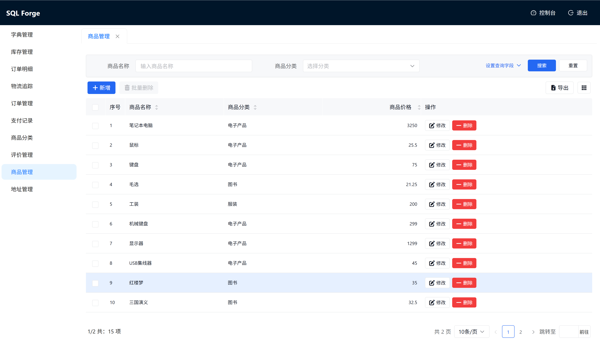
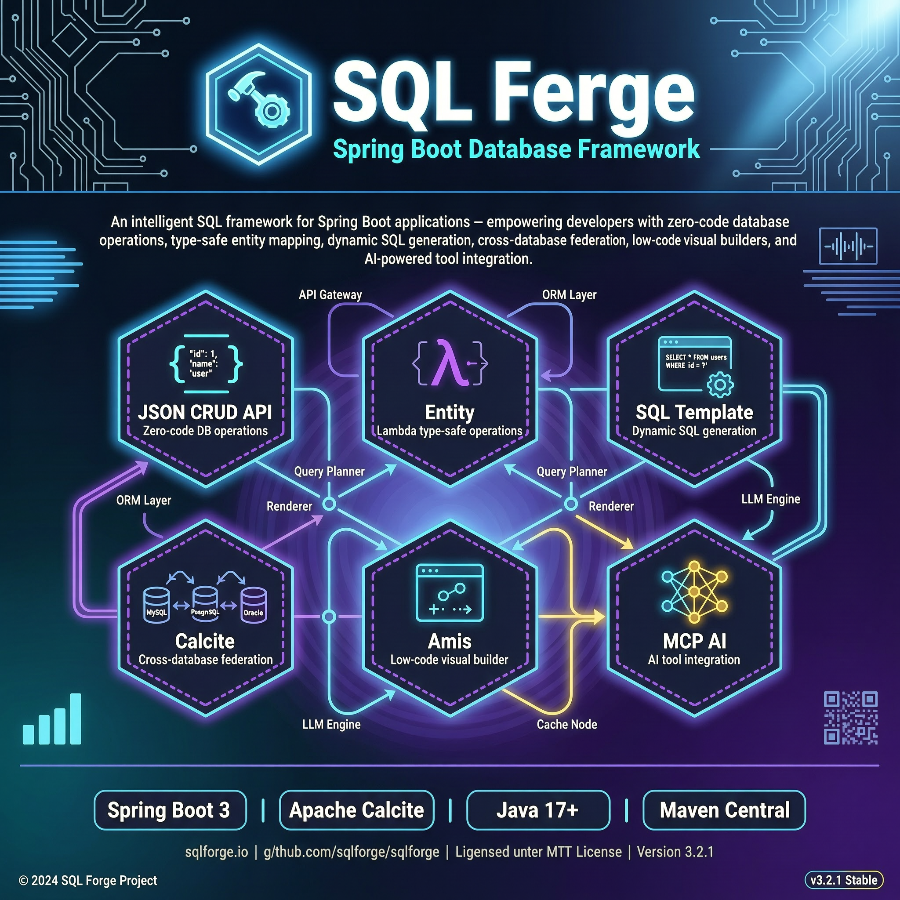
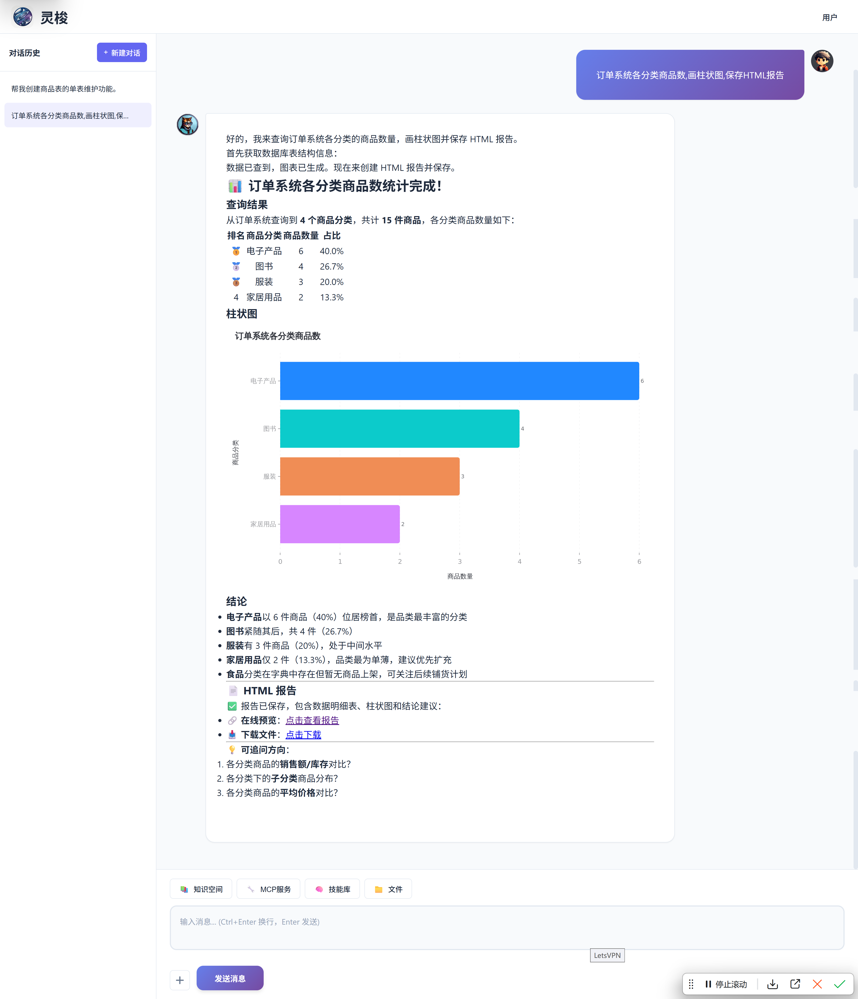
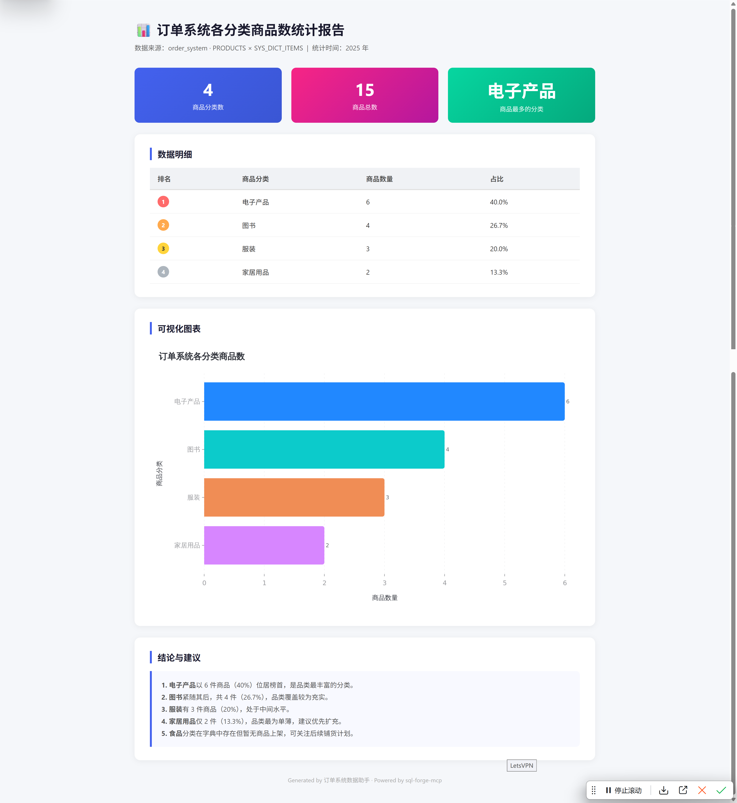
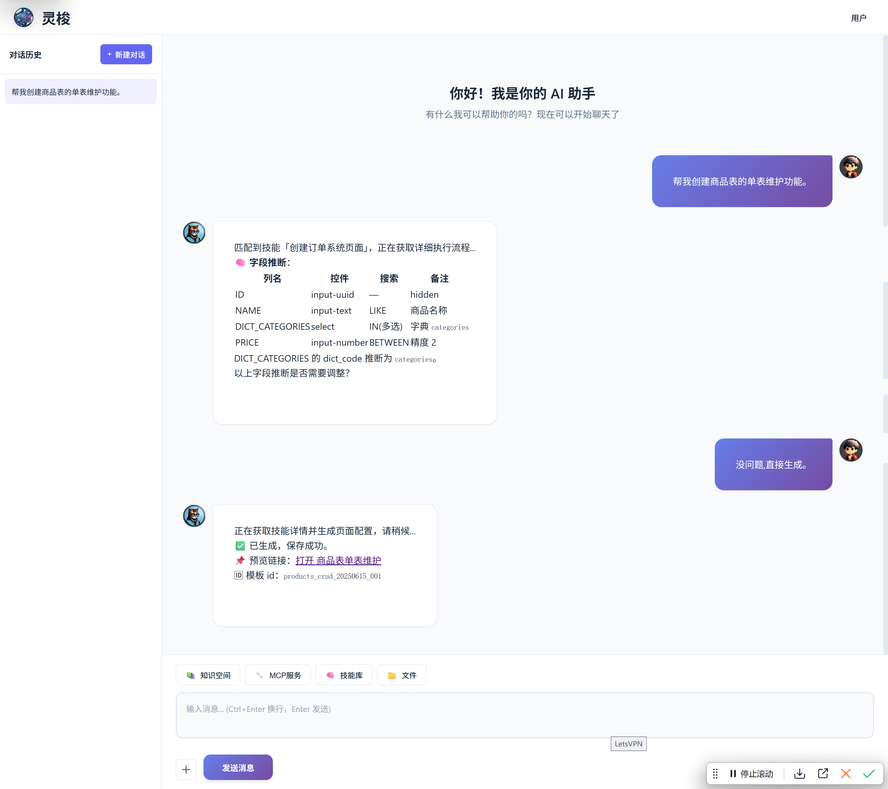
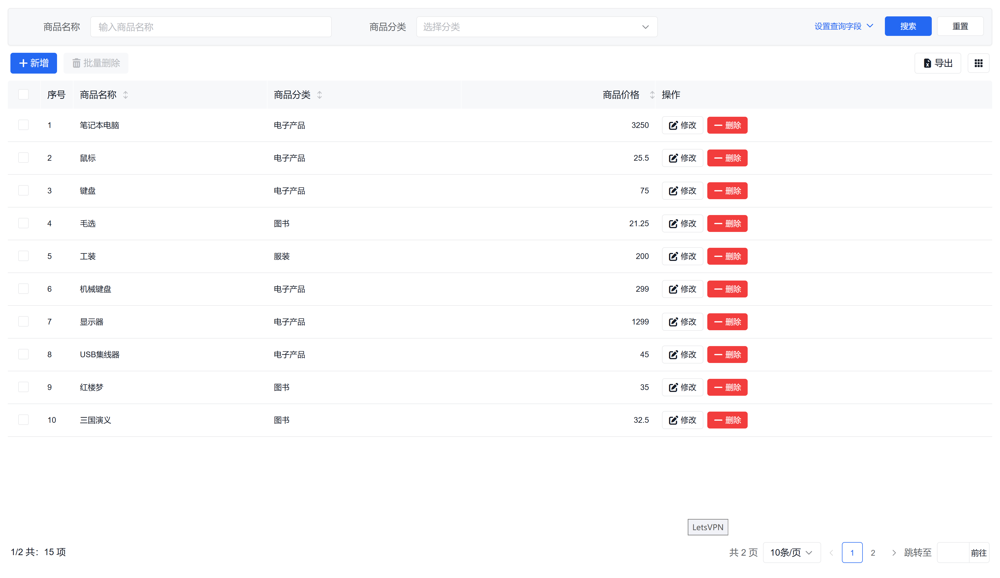
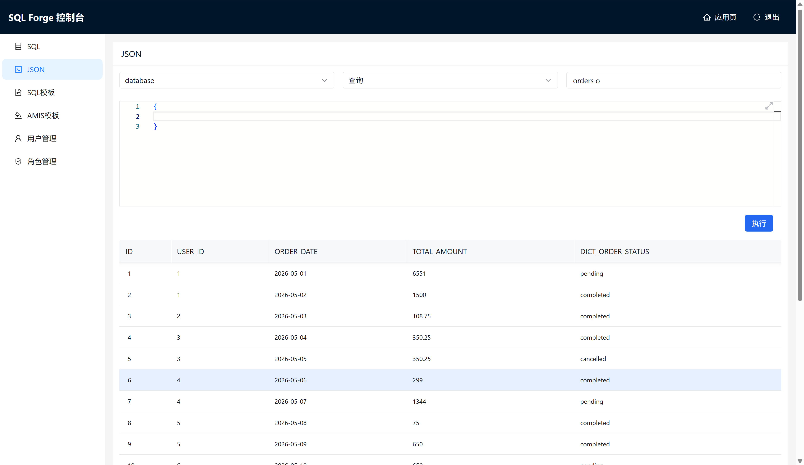
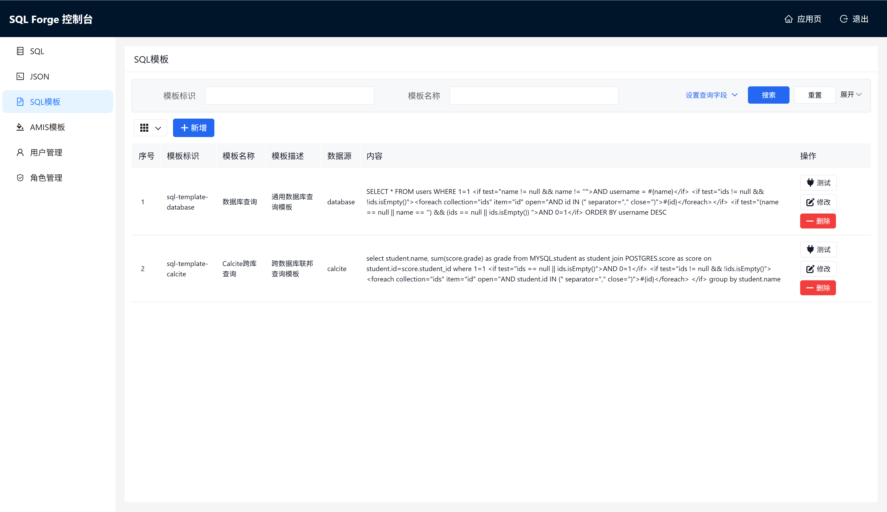
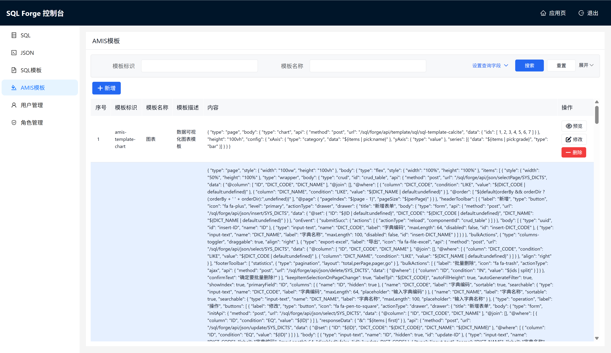

# SQL Forge

<div align="right">
  English | <a href="README.zh-CN.md">中文</a>
</div>

> a Spring Boot database framework providing JSON CRUD API, type-safe entity operations, SQL template engine, Apache Calcite cross-database federated queries, Amis low-code visual management, and MCP (Model Context Protocol) server for AI tool integration. Ready to use, import on demand.


[](https://gitee.com/wb04307201/sql-forge)
[](https://gitee.com/wb04307201/sql-forge)
[](https://github.com/wb04307201/sql-forge)
[](https://github.com/wb04307201/sql-forge)  
  

<table style="width: 100%; table-layout: fixed; border-collapse: collapse;">
  <tr>
    <td style="padding: 0 10px; border: none; text-align: center;font-weight: bold;" colspan="12">
      SQL Forge
    </td>
  </tr>
  <tr>
    <td style="padding: 0 10px; border: none; text-align: center;font-weight: bold;" colspan="4">
      App Page
    </td>
    <td style="padding: 0 10px; border: none; text-align: center;font-weight: bold;" colspan="4">
      Project Overview
    </td>
    <td style="padding: 0 10px; border: none; text-align: center;font-weight: bold;" colspan="4">
      Console
    </td>
  </tr>
  <tr>
    <td style="padding: 0 10px; border: none; text-align: center;" colspan="4">
      
    </td>
    <td style="padding: 0 10px; border: none; text-align: center;" colspan="4">
      
    </td>
    <td style="padding: 0 10px; border: none; text-align: center;" colspan="4">
      
    </td>
  </tr>
  <tr>
    <td style="padding: 0 10px; border: none; text-align: center;font-weight: bold;" colspan="12">
      Using MCP to Connect AI Agents
    </td>
  </tr>
  <tr>
    <td style="padding: 0 10px; border: none; text-align: center;font-weight: bold;" colspan="6">
      One-Sentence Report
    </td>
    <td style="padding: 0 10px; border: none; text-align: center;font-weight: bold;" colspan="6">
      One-Sentence CRUD
    </td>
  </tr>
  <tr>
    <td style="padding: 0 10px; border: none; text-align: center;" colspan="3">
      
    </td>
    <td style="padding: 0 10px; border: none; text-align: center;" colspan="3">
      
    </td>
    <td style="padding: 0 10px; border: none; text-align: center;" colspan="3">
      
    </td>
    <td style="padding: 0 10px; border: none; text-align: center;" colspan="3">
      
    </td>
  </tr>
  <tr>
    <td style="padding: 0 10px; border: none; text-align: center;font-weight: bold;" colspan="6">
      Agent: Loom<br/>
      <a href="https://gitee.com/wb04307201/spring-ai-loom-agent">Gitee</a> |
      <a href="https://github.com/wb04307201/spring-ai-loom-agent">GitHub</a>
    </td>
    <td style="padding: 0 10px; border: none; text-align: center;font-weight: bold;" colspan="6">
      Example: JavaBrain<br/>
      <a href="https://gitee.com/wb04307201/java-brain">Gitee</a> |
      <a href="https://github.com/wb04307201/java-brain">GitHub</a>
    </td>
  </tr>
</table>

---

## Quick Start

### Import Dependencies

Import the starters you need:

```xml
<!-- Core database operations (required) -->
<dependency>
    <groupId>io.github.wb04307201</groupId>
    <artifactId>sql-forge-spring-boot-starter</artifactId>
    <version>1.6.2</version>
</dependency>

<!-- Calcite cross-database federated queries (optional) -->
<dependency>
    <groupId>io.github.wb04307201</groupId>
    <artifactId>sql-forge-calcite-spring-boot-starter</artifactId>
    <version>1.6.2</version>
</dependency>

<!-- Amis templates + Web Console (optional) -->
<dependency>
    <groupId>io.github.wb04307201</groupId>
    <artifactId>sql-forge-web-spring-boot-starter</artifactId>
    <version>1.6.2</version>
</dependency>
```

For `@Id`, `@Table`, `@Column` annotations in the Entity module, additionally import:

```xml
<dependency>
    <groupId>jakarta.persistence</groupId>
    <artifactId>jakarta.persistence-api</artifactId>
    <version>3.2.0</version>
</dependency>
```

## Starter Overview

| Starter | Description |
|---------|-------------|
| **sql-forge-spring-boot-starter** | Core starter: database executor, JSON CRUD API, type-safe entity operations (Entity), SQL template engine, Record operation aspects, built-in user authentication (Session + ApiKey) |
| **sql-forge-calcite-spring-boot-starter** | Apache Calcite-based cross-database federated query executor for MySQL, PostgreSQL, and more |
| **sql-forge-web-spring-boot-starter** | Amis low-code template management API, Web Console UI, user/role management |
| **sql-forge-mcp** | Model Context Protocol (MCP) server for AI tool integration — exposes database metadata, SQL execution, and Amis template management as MCP tools via stdio |

---

## Build a Complete System Without Writing Backend Code

> Write zero Java backend code. Use JSON configuration to build a full business system with **data access · dynamic SQL · cross-database federation · authentication & authorization · visual pages · AI integration**.

### Capability Loop

SQL Forge decomposes "building a system" into eight no-code stages. Use any one independently, or compose them freely:

| Layer | Capability | Configuration | Endpoint |
|-------|-----------|---------------|----------|
| Data access | CRUD / pagination / multi-table joins | JSON-described conditions | `POST /sql/forge/api/json/{method}/{tableName}` |
| Complex queries | Conditional branches, `IN` loops, reports | Template syntax `<if>` / `<foreach>` | `POST /sql/forge/api/template/sql/{id}` |
| Cross-database federation | MySQL, PostgreSQL and other heterogeneous DBs joined in one SQL | JSON + `model.json` | `executorName=calcite` |
| Authentication | Session login + ApiKey dual channel | YAML / endpoints | Built-in |
| Authorization | User—role—page three-level grants | Endpoints | `/api/role-template` · `/api/user-role` |
| Pages | CRUD forms, charts, details, dialogs | Amis JSON Schema | `PUT /api/template/amis` |
| Console | Metadata browser, SQL/template/page debugging | Browser | `/sql/forge/web` |
| AI integration | Natural language to CRUD / reports / pages | MCP tools | Any MCP client |

### 30-Second Quick Start

1. **Write an Amis JSON** → `PUT /api/template/amis` renders a CRUD page automatically
2. **Point the page's `api` field** to `/sql/forge/api/json/{method}/{table}` → data reads/writes itself
3. **Need cross-database query?** Change `executorName` in the URL to `calcite` — no SQL changes
4. **Want AI to use it too?** Start `sql-forge-mcp`; Claude / Cursor can operate via natural language
5. **Want to restrict who sees which pages?** Use `/api/role-template` to grant Amis templates to roles

The following sections are detailed documentation for each stage — read as needed.

---

## 1. sql-forge-spring-boot-starter (Core Starter)

Provides core database capabilities including executor management, JSON CRUD API, Entity chain operations, SQL template engine, and Record aspect extensions.

### 1.1 SQL Executor

`sql-forge-spring-boot-starter` automatically registers an executor named `database`, directly using the DataSource already configured in your Spring project.

```yaml
sql:
  forge:
    schemata:  # Configure schema
      - PUBLIC
```

#### Custom Executor

Implement the [IExecutor](sql-forge-core/src/main/java/cn/wubo/sql/forge/IExecutor.java) interface and register it as a Spring Bean to extend with custom executors.

```java
@Component
public class MyCustomExecutor implements IExecutor {
    @Override
    public String getExecutorName() {
        return "myCustom";
    }
    // ... implement other methods
}
```

### 1.2 Direct Database API

Provides the ability to execute SQL directly (disabled by default, must be manually enabled).

```yaml
sql:
  forge:
    api:
      database:
        enabled: true       # Enable direct database API
        select-only: true   # true=SELECT only, false=allow all operations
```

- `POST /sql/forge/api/database/execute?executorName=database` - Execute SQL

> 💡 **Low-code perspective**: This is the data access layer of the no-code system. The frontend calls one URL to perform CRUD, pagination, and JOIN on any table — no backend code required.

### 1.3 JSON CRUD API

Allows frontend to operate the database without writing backend code — describe the desired data structure and operations via `JSON`, and the backend automatically generates and executes the corresponding `SQL`.

- **Request Path**: `sql/forge/api/json/{method}/{tableName}?executorName={executorName}`
- **Request Method**: `POST`
- **Content Type**: `application/json`
- **Path Parameters**:
  - `{method}`: Operation type (delete, insert, select, selectPage, update)
  - `{tableName}`: Database table name
  - `{executorName}`: Executor name, defaults to `database` if not provided

#### delete method

```json
{
  "@where": [
    {
      "column": "field_name",
      "condition": "condition_type",
      "value": "value"
    }
  ],
  "@with_select": {
    // Query JSON after deletion
  }
}
```

**Parameters**
- `@where`: Delete condition array
  - column: Field name to match
  - condition: Condition type (EQ, NOT_EQ, GT, LT, GTEQ, LTEQ, LIKE, NOT_LIKE, LEFT_LIKE, RIGHT_LIKE, BETWEEN, NOT_BETWEEN, IN, NOT_IN, IS_NULL, IS_NOT_NULL)
  - value: Value to match
- `@with_select`: Optional, execute a query after deletion

#### insert method

```json
{
  "@set": {
    "field1": "value1",
    "field2": "value2"
  },
  "@with_select": {
    // Query JSON after insertion
  }
}
```

**Parameters**
- `@set`: Key-value pairs of fields and values to insert, at least one field required
- `@with_select`: Optional, execute a query after insertion

#### select method

```json
{
  "@column": ["field1", "field2"],
  "@where": [
    {
      "column": "field_name",
      "condition": "condition_type",
      "value": "value"
    }
  ],
  "@join": [
    {
      "type": "JOIN type",
      "joinTable": "join_table_name",
      "on": "join_condition"
    }
  ],
  "@order": ["field_name ASC", "field_name DESC"],
  "@group": ["field_name"],
  "@distinct": false
}
```

**Parameters**
- `@column`: Array of fields to query, queries all fields if empty
- `@where`: Query condition array
- `@join`: Join condition array
- `@order`: Sort field array
- `@group`: Group by field array
- `@distinct`: Whether to deduplicate

#### selectPage method

```json
{
  "@column": ["field1", "field2"],
  "@where": [
    {
      "column": "field_name",
      "condition": "condition_type",
      "value": "value"
    }
  ],
  "@page": {
    "pageIndex": 0,
    "pageSize": 10
  },
  "@join": [
    {
      "type": "JOIN type",
      "joinTable": "join_table_name",
      "on": "join_condition"
    }
  ],
  "@order": ["field_name ASC", "field_name DESC"],
  "@distinct": false
}
```

**Parameters**
- `@column`: Array of fields to query, queries all fields if empty
- `@where`: Query condition array
- `@page`: Pagination parameters (pageIndex starts from 0, pageSize is page size)
- `@join`: Join condition array
- `@order`: Sort field array
- `@distinct`: Whether to deduplicate

#### update method

```json
{
  "@set": {
    "field1": "new_value1",
    "field2": "new_value2"
  },
  "@where": [
    {
      "column": "field_name",
      "condition": "condition_type",
      "value": "value"
    }
  ],
  "@with_select": {
    // Query JSON after update
  }
}
```

**Parameters**
- `@set`: Key-value pairs of fields and new values, at least one field required
- `@where`: Update condition array
- `@with_select`: Optional, execute a query after update

#### Examples

1. Query

```http request
POST http://localhost:8081/sql/forge/api/json/select/orders o
Content-Type: application/json

{
  "@column": [
    "u.username",
    "o.total_amount",
    "p.name               AS product_name",
    "oi.unit_price",
    "oi.quantity",
    "p.price"
  ],
  "@where": [
    {
      "column": "u.username",
      "condition": "IS_NOT_NULL",
      "value": null
    }
  ],
  "@join": [
    {
      "type": "JOIN",
      "joinTable": "users u",
      "on": "o.user_id = u.id"
    },
    {
      "type": "JOIN",
      "joinTable": "order_items oi",
      "on": "o.id = oi.order_id"
    },
    {
      "type": "JOIN",
      "joinTable": "products p",
      "on": "oi.product_id = p.id"
    }
  ],
  "@order": [
    "o.order_date"
  ]
}
```

2. Paginated Query

Simply add the `@page` parameter to a query JSON:

```http request
POST http://localhost:8081/sql/forge/api/json/selectPage/orders o
Content-Type: application/json

{
  "@column": ["o.total_amount", "p.name AS product_name"],
  "@join": [
    {
      "type": "JOIN",
      "joinTable": "products p",
      "on": "o.product_id = p.id"
    }
  ],
  "@order": ["o.order_date"],
  "@page": {
    "pageIndex": 0,
    "pageSize": 5
  }
}
```

3. Insert

```http request
POST http://localhost:8081/sql/forge/api/json/insert/users
Content-Type: application/json

{
  "@set": {
    "id": "26a05ba3-913d-4085-a505-36d40021c8d1",
    "username": "wb04307201",
    "password": "123456",
    "enabled": true,
    "category": "user"
  },
  "@with_select": {
    "@where": [
      {
        "column": "id",
        "condition": "EQ",
        "value": "26a05ba3-913d-4085-a505-36d40021c8d1"
      }
    ]
  }
}
```

4. Update

```http request
POST http://localhost:8081/sql/forge/api/json/update/users
Content-Type: application/json

{
  "@set": {
    "password": "newpassword"
  },
  "@where": [
    {
      "column": "id",
      "condition": "EQ",
      "value": "26a05ba3-913d-4085-a505-36d40021c8d1"
    }
  ],
  "@with_select": {
    "@where": [
      {
        "column": "id",
        "condition": "EQ",
        "value": "26a05ba3-913d-4085-a505-36d40021c8d1"
      }
    ]
  }
}
```

5. Delete

```http request
POST http://localhost:8081/sql/forge/api/json/delete/users
Content-Type: application/json

{
  "@where": [
    {
      "column": "id",
      "condition": "EQ",
      "value": "26a05ba3-913d-4085-a505-36d40021c8d1"
    }
  ],
  "@with_select": {
    "@where": [
      {
        "column": "id",
        "condition": "EQ",
        "value": "26a05ba3-913d-4085-a505-36d40021c8d1"
      }
    ]
  }
}
```

#### Pre-execution Aspects

Customize JSON adjustments before method execution by implementing the [IBeforeRecordExecutor](sql-forge-record/src/main/java/cn/wubo/sql/forge/record/IBeforeRecordExecutor.java) interface — for password encryption, auto-timestamps, access control, logging, auditing, etc.

For example, logging on Insert:

```java
@Slf4j
@Component
public class LogInsertExecute implements IBeforeRecordExecutor<Insert> {
  @Override
  public Boolean support(String tableName, Insert insert) {
    return true;
  }

  @Override
  public Insert before(String tableName, Insert insert) {
    log.info("LogInsertExecute tableName: {} record: {}", tableName, insert);
    return insert;
  }
}
```

### 1.4 Authentication & ApiKey

The core starter includes a built-in user authentication system. All APIs require authentication by default, supporting both **Session login** and **ApiKey** — either one is sufficient to access.

#### ApiKey Authentication

Pass the ApiKey via the `X-Api-Key` request header to access all APIs without logging in:

```yaml
sql:
  forge:
    api-keys:                # ApiKey list (empty by default, meaning ApiKey authentication is disabled)
      - sk-your-api-key-here
      - sk-another-key
```

Request example:

```http request
GET http://localhost:8081/sql/forge/api/json/select/users
X-Api-Key: sk-your-api-key-here
```

#### Session Login Authentication

Obtain a Session via the login endpoint; subsequent requests automatically carry the Session cookie:

- `POST /sql/forge/api/auth/login` - User login (Body: `{"username": "admin", "password": "admin123"}`)
- `POST /sql/forge/api/auth/logout` - User logout
- `GET /sql/forge/api/auth/status` - Get current login status
- `GET /sql/forge/api/auth/user` - Get current user info

> Default admin account: `admin` / `admin123`

#### Authentication Priority

```
Request → Valid ApiKey? → Allow
        → Session logged in? → Allow
        → Neither → 401 Denied
```

Whitelisted paths (login endpoints, static resources) are accessible without authentication.

> 💡 **Low-code perspective**: This is the complex query layer. Conditional branches (`<if>`), `IN` loops (`<foreach>`), and reports are all configured via template syntax — no Java needed.

### 1.5 SQL Template Engine

Provides SQL template functionality supporting conditionals (`<if>`), loops (`<foreach>`), and variable binding (`#{var}`), dynamically generating and executing SQL based on parameters.

#### Template Management Endpoints

- `PUT /sql/forge/api/template/sql` - Save/Update SQL template
  - id: Template ID
  - executorName: Executor name, defaults to `database`
  - context: Template content
- `GET /sql/forge/api/template/sql/{id}` - Get SQL template by ID
- `GET /sql/forge/api/template/sql` - Get SQL template list
- `DELETE /sql/forge/api/template/sql/{id}` - Delete SQL template by ID
- `POST /sql/forge/api/template/sql/{id}` - Execute SQL template by ID (Body is a parameter Map)

#### Example

Template configuration:

```http request
PUT http://localhost:8081/sql/forge/api/template/sql
content-type: application/json

{
    "id": "sql-template-database",
    "type": "templateSql",
    "executorName": "database",
    "context": "SELECT * FROM users WHERE 1=1\r\n<if test=\"name != null && name != ''\">AND username = #{name}</if>\r\n<if test=\"ids != null && !ids.isEmpty()\"><foreach collection=\"ids\" item=\"id\" open=\"AND id IN (\" separator=\",\" close=\")\">#{id}</foreach></if>\r\n<if test=\"(name == null || name == '') && (ids == null || ids.isEmpty()) \">AND 0=1</if>\r\nORDER BY username DESC"
}
```

Execute template:

```http request
POST http://localhost:8081/sql/forge/api/template/sql/sql-template-database
content-type: application/json

{
  "name": "alice",
  "ids": null
}
```

Response:

```json
[
  {
    "ID": "1",
    "USERNAME": "alice"
  }
]
```

#### Persistent Templates

Uses in-memory storage by default. Implement [ITemplateSqlStorage](sql-forge-template/src/main/java/cn/wubo/sql/forge/ITemplateSqlStorage.java) for custom persistence.

### 1.6 Entity Module

Provides type-safe entity operation builders with compile-time safe field references via Lambda expressions, supporting chain calls.

- [Entity](sql-forge-entity/src/main/java/cn/wubo/sql/forge/Entity.java) — Static utility class providing `select/insert/update/delete/save/selectPage` entry points
- [EntityExecutor](sql-forge-entity/src/main/java/cn/wubo/sql/forge/EntityExecutor.java) — Executes builder database operations

#### Features

- Chain calls for concise code
- Lambda expressions for compile-time field reference checking
- Builder pattern for flexible query condition configuration
- Unified database operation entry point

#### Usage Examples

Define a user entity class:

```java
@Data
@Table(name = "users")
public class User {
    @Id
    private String id;

    @Column(name = "username")
    private String username;

    @Column(name = "password")
    private String password;

    @Column(name = "category")
    private String category;
}
```

Database operations using Entity:

```java
@Autowired
private EntityExecutor entityExecutor;

// Query operation
EntitySelect<User> select = Entity.select(User.class)
                .distinct(true)
                .columns(User::getId, User::getUsername, User::getCategory)
                .orders(User::getUsername)
                .in(User::getUsername, "alice", "bob");
List<User> users = entityExecutor.run(select);

// Paginated query operation
EntitySelectPage<User> selectPage = Entity.selectPage(User.class)
        .columns(User::getId, User::getUsername, User::getCategory)
        .orders(User::getUsername)
        .page(0, 10);
SelectPageResult<User> result = entityExecutor.run(selectPage);

// Insert operation
EntityInsert<User> insert = Entity.insert(User.class)
        .set(User::getId, UUID.randomUUID().toString())
        .set(User::getUsername, "wb04307201")
        .set(User::getPassword, "123456");
entityExecutor.run(insert);

// Update operation
EntityUpdate<User> update = Entity.update(User.class)
        .set(User::getPassword, "newpassword")
        .eq(User::getId, id);
int count = entityExecutor.run(update);

// Delete operation
EntityDelete<User> delete = Entity.delete(User.class)
        .eq(User::getId, id);
count = entityExecutor.run(delete);

// Object save (auto-detects insert or update)
User user = new User();
user.setUsername("wb04307201");
user.setPassword("123456");
user = entityExecutor.run(Entity.save(user));  // id is null, performs insert

user.setPassword("newpassword");
user = entityExecutor.run(Entity.save(user));  // id is not null, performs update

// Object delete
count = entityExecutor.run(Entity.delete(user));
```

#### Query Builder Reference

**1. Column Selection**
- `column(SFunction<T, ?> column)` - Select single column
- `columns(SFunction<T, ?>... columns)` - Select multiple columns

**2. Query Conditions**
- `eq(SFunction<T, ?> column, Object value)` - Equals
- `neq(SFunction<T, ?> column, Object value)` - Not equals
- `gt(SFunction<T, ?> column, Object value)` - Greater than
- `lt(SFunction<T, ?> column, Object value)` - Less than
- `gteq(SFunction<T, ?> column, Object value)` - Greater than or equals
- `lteq(SFunction<T, ?> column, Object value)` - Less than or equals
- `like(SFunction<T, ?> column, Object value)` - Like
- `notLike(SFunction<T, ?> column, Object value)` - Not like (NOT LIKE)
- `leftLike(SFunction<T, ?> column, Object value)` - Left like
- `rightLike(SFunction<T, ?> column, Object value)` - Right like
- `between(SFunction<T, ?> column, Object value1, Object value2)` - Between
- `notBetween(SFunction<T, ?> column, Object value1, Object value2)` - Not between
- `in(SFunction<T, ?> column, Object... value)` - In
- `notIn(SFunction<T, ?> column, Object... value)` - Not in
- `isNull(SFunction<T, ?> column)` - Is NULL
- `isNotNull(SFunction<T, ?> column)` - Is NOT NULL

**3. Sorting**
- `orderAsc(SFunction<T, ?> column)` - Ascending sort
- `orderDesc(SFunction<T, ?> column)` - Descending sort
- `orders(SFunction<T, ?>... columns)` - Multi-column sorting (default ascending)

**4. Pagination**
- `page(Integer pageIndex, Integer pageSize)` - Set pagination parameters

**5. Deduplication**
- `distinct(Boolean distinct)` - Set whether to deduplicate

#### Object Save Description

Determines primary key field based on `@Id` annotation. Throws `IllegalArgumentException` if no primary key field exists.

- **Insert condition**: Executes insert when primary key value is `null`
  - `String` type primary key: Automatically generates `UUID` as primary key value
  - Other type primary keys: Uses database auto-generated primary key value
- **Update condition**: Executes update when primary key value is not `null`
  - Uses primary key value as update condition

> **Note**: To insert a new record with a pre-set primary key value, use `Entity.insert()` instead of `Entity.save()`, because `save()` performs an update when the primary key is not `null`.

---

## 2. sql-forge-calcite-spring-boot-starter (Cross-Database Federated Queries)

Based on [Apache Calcite](https://calcite.apache.org/), enables cross-database federated queries — join data from MySQL, PostgreSQL, and other databases in a single SQL statement.

> Depends on the core starter (`sql-forge-spring-boot-starter`), which is automatically included.

### Configuration

```yaml
sql:
  forge:
    calcite:
      enabled: true                          # Enable Calcite
      configuration: classpath:model.json    # Calcite model configuration file path
      schemata:                              # Configure schema
        - MYSQL
        - POSTGRES
```

`model.json` describes the Calcite data source connection information. Refer to the [Apache Calcite documentation](https://calcite.apache.org/docs/model.html).

### Usage

Once enabled, a `calcite` executor is automatically registered. Use `executorName=calcite` in any API:

```http request
POST http://localhost:8081/sql/forge/api/json/select/orders o?executorName=calcite
Content-Type: application/json

{
  "@column": ["o.id", "u.username", "p.name"],
  "@join": [
    {
      "type": "JOIN",
      "joinTable": "MYSQL_DB.users u",
      "on": "o.user_id = u.id"
    },
    {
      "type": "JOIN",
      "joinTable": "POSTGRES_DB.products p",
      "on": "o.product_id = p.id"
    }
  ]
}
```

---

## 3. sql-forge-web-spring-boot-starter (Amis + Console)

Provides Amis low-code template management, Web Console UI, and user/role management.

> Depends on the core starter (`sql-forge-spring-boot-starter`), which is automatically included.

> 💡 **Low-code perspective**: This is the page layer. Drop the JSON CRUD URL from 1.3 or the SQL template URL from 1.5 into the Amis `api` field — the page works.

### 3.1 Amis Template API

Use [Amis](https://aisuda.bce.baidu.com/amis/zh-CN/docs/index) together with JSON API and SQL Template API to rapidly build web pages.

#### Template Management Endpoints

- `PUT /sql/forge/api/template/amis` - Save/Update Amis template
  - id: Template ID
  - name: Template name
  - description: Template description
  - context: Amis JSON Schema content
- `GET /sql/forge/api/template/amis/{id}` - Get template by ID
- `GET /sql/forge/api/template/amis` - Get template list
- `DELETE /sql/forge/api/template/amis/{id}` - Delete template by ID

#### Example

```http request
PUT http://localhost:8081/sql/forge/api/template/amis
content-type: application/json

{
    "id": "amis-template-products",
    "name": "Product Management",
    "context": "{ \"type\": \"page\", \"body\": { \"type\": \"crud\", ... } }"
}
```

Rendered page:


#### Persistent Templates

Uses in-memory storage by default. Implement [ITemplateAmisStorage](sql-forge-web-autoconfigure/src/main/java/cn/wubo/sql/forge/ITemplateAmisStorage.java) for custom persistence.

> 💡 **Low-code perspective**: This is the debug & operations layer. Every template, metadata, and SQL query is managed visually in the browser — no command line required.

### 3.2 Web Console

Provides a visual web interface at: `/sql/forge/web`

- Database metadata viewing and SQL debugging (requires `sql.forge.api.database.enabled=true`)
  
- JSON API debugging
  
- SQL template management and debugging
  
- Amis template management and debugging
  

### 3.3 User & Role Management

The authentication system (Session login + ApiKey) is built into the core starter. See [1.4 Authentication & ApiKey](#14-authentication--apikey) for details. This section only describes user/role management features specific to Web Console.

#### User Management Endpoints (admin required)

- `GET /sql/forge/api/user` - Get user list
- `PUT /sql/forge/api/user` - Save/Update user
- `DELETE /sql/forge/api/user/{id}` - Delete user

#### Role Management Endpoints

- `GET /sql/forge/api/role` - Get role list
- `PUT /sql/forge/api/role` - Save/Update role (admin required)
- `DELETE /sql/forge/api/role/{id}` - Delete role (admin required)
- `GET /sql/forge/api/role-template?role={roleId}` - Get template IDs associated with a role
- `PUT /sql/forge/api/role-template` - Set role-template associations (admin required)
- `GET /sql/forge/api/user-role?userId={userId}` - Get role IDs for a user (admin required)
- `PUT /sql/forge/api/user-role` - Set user-role associations (admin required)

#### Extending Persistent Storage

All storage uses in-memory implementations by default. Replace with database persistence by implementing the following interfaces:

| Interface | Description |
|-----------|-------------|
| [IUserStorage](sql-forge-core/src/main/java/cn/wubo/sql/forge/IUserStorage.java) | User storage |
| [IUserRoleStorage](sql-forge-core/src/main/java/cn/wubo/sql/forge/IUserRoleStorage.java) | User-role association storage |
| [IRoleStorage](sql-forge-web-autoconfigure/src/main/java/cn/wubo/sql/forge/IRoleStorage.java) | Role storage |
| [IRoleTemplateStorage](sql-forge-web-autoconfigure/src/main/java/cn/wubo/sql/forge/IRoleTemplateStorage.java) | Role-template association storage |

Simply implement the interface and register as a Spring Bean to automatically replace the default implementation (`@ConditionalOnMissingBean`).

---

## 4. sql-forge-mcp (AI MCP Server)

A [Model Context Protocol](https://modelcontextprotocol.io/) (MCP) server that exposes sql-forge backend capabilities as AI-callable tools via **stdio** transport, so Claude Code, Claude Desktop, Cursor, Windsurf and other AI assistants can "see" database metadata, read Amis knowledge, assemble Amis pages from natural language descriptions, save them to the system, and validate with headless Chromium rendering.

> Requires a running sql-forge backend (with `sql.forge.api.database.enabled=true`) and Playwright Chromium installed for `previewAmisTemplate`.

### MCP Three Primitives at a Glance

The MCP server splits capabilities into three primitives (**29 Tools** + **5 Resources** + **3 Prompts**):

- **Tools = actions** (CRUD, validation, rendering, save) — invoked on demand
- **Resources = read-only references** (Amis knowledge, component catalog, examples) — recommended to pre-load into context at AI client init
- **Prompts = task templates** (pre-built instructions with placeholders) — triggerable as `/slash-command`

### Metadata

| Tool | Description |
|------|-------------|
| `getSystems` | Get all configured system information |
| `getMetaDataDatabase` | Get database product name and version for a system |
| `sqlForgeMetaDataTables` | Get all tables in a system's database |
| `getMetaDataTableInfo` | Get table structure: columns, primary keys, foreign keys, indexes |
| `getMetaDataTree` | Get tree-shaped metadata (database → schema → tables) |
| `listExecutorNames` | List available executor names in a system (e.g. database, calcite) |
| `findTablesByName` | Search tables by keyword (case-insensitive) |
| `describeSchema` | Get full schema (database → tables → columns/PKs/FKs/indexes) |

### JSON CRUD

| Tool | Description |
|------|-------------|
| `jsonSelect` | Conditional select (POST /api/json/select/{tableName}) |
| `jsonSelectPage` | Paginated select (POST /api/json/selectPage/{tableName}) |
| `jsonInsert` | Insert a record (POST /api/json/insert/{tableName}) |
| `jsonUpdate` | Update records by condition (POST /api/json/update/{tableName}) |
| `jsonDelete` | Delete records by condition (POST /api/json/delete/{tableName}) |
| `countRows` | Count rows matching optional WHERE conditions |

### SQL Template & Execution

| Tool | Description |
|------|-------------|
| `executeSQL` | Execute SQL directly (SELECT only by default, controlled by `sql.forge.api.database.select-only`) |
| `saveSqlTemplate` | Save or update a SQL template (Enjoy syntax: `#{}` placeholders, `<if>`/`<foreach>` conditionals) |
| `listSqlTemplates` | List SQL templates with optional filters |
| `getSqlTemplate` | Get a single SQL template by ID |
| `deleteSqlTemplate` | Delete a SQL template by ID |
| `executeSqlTemplate` | Execute a SQL template with parameter binding |
| `executeSqlTemplateSafely` | Safer execution: validates template exists + params complete + refuses unbound-placeholder SQL (recommended) |

### Amis Template CRUD

| Tool | Description |
|------|-------------|
| `amisTemplateSave` | Save an Amis page JSON template (persists to backend's Amis table) |
| `listAmisTemplates` | List Amis templates (fuzzy filter on id/name/description/context) |
| `getAmisTemplate` | Get a single Amis template by ID |
| `deleteAmisTemplate` | Delete an Amis template by ID (destructive; Agent should confirm with user) |

### Amis Actions & MCP Health

| Tool | Description |
|------|-------------|
| `validateAmisTemplate` | Static validation: JSON syntax, required fields, component type, API format, nested recursion. Returns `{valid, errors[]}` (severity: error/warning) |
| `previewAmisTemplate` | **Real render** via headless Chromium (self-contained HTML via `page.setContent()`, **no popup**). Returns `{available, rendered, reason, errors[]}`. Degrades to `available=false + reason` when Chromium unavailable |
| `mcpHealth` | Health check on MCP itself + each backend + Playwright. Returns `{overall, mcp, backends, playwright, limits}`. For liveness probe, Agent startup self-check, manual troubleshooting |
| `metrics` | In-process metrics: per-Tool call count, error count, avg latency, max latency. For liveness, alerting, Agent self-diagnosis |

### MCP Resources (5 read-only)

| URI | mimeType | Description |
|---|---|---|
| `amis://schema-hints` | `text/markdown` | Full Amis Schema cheat sheet (expressions / API idioms / CRUD patterns / pitfall list). **Strongly recommended as resident reference** |
| `amis://components` | `application/json` | Component catalog lightweight index (type/name/category/description only, 54 entries) |
| `amis://examples` | `application/json` | Example lightweight index (name/title/tags/description only, 17 entries) |
| `amis://components/{type}` | `application/json` | Get component full spec by type (with required/keyProps/minimalExample/docUrl) |
| `amis://examples/{name}` | `application/json` | Get full runnable JSON Schema by name, as template base |

> Resources are exposed via `AmisMcpResources` (spring-ai 1.1.x programmatic `List<McpServerFeatures.SyncResourceSpecification>` Bean). Round 5 moved 6 Amis-knowledge Tools to Resources so AI clients can pre-load `amis://schema-hints` into the system prompt without invoking.

### MCP Prompts (3 task templates)

| Prompt | Args | Purpose |
|---|---|---|
| `create-amis-page` | `<systemName> <tableName> <pageTitle>` | Standard pipeline: probe table → read schema-hints → read component spec → adapt → validate → preview |
| `diagnose-render-error` | `<context> <errors>` | Feed failed preview errors back, have AI fix the schema and try again |
| `quick-crud-template` | `<systemName> <tableName> [withFilter]` | One-shot skeleton: read-only mode, minimum dialogue to produce a minimal CRUD |

### Agent Build Pipeline (11 standard steps)

```
1.  tools/call   mcpHealth                            → confirm backend reachable + Chromium available
2.  tools/call   findTablesByName / describeSchema     → probe table + column metadata
3.  resources/read amis://schema-hints                 → cheat sheet (recommend resident)
4.  resources/read amis://components/crud             → required fields
5.  resources/read amis://examples/crud-page          → example schema as template base
6.  tools/call   validateAmisTemplate(json)           → must pass first
7.  tools/call   previewAmisTemplate(systemName, json) → visual validation (headless, no popup)
8.  tools/call   amisTemplateSave(...)                 → save to backend
9.  tools/call   getAmisTemplate(...)                 → round-trip verification
10. tools/call   update / re-validate / re-preview    → modify and re-save
11. tools/call   deleteAmisTemplate(...)               → cleanup
```

> A full hands-on walkthrough (with expected return per step, common error fixes, Prompts triggers) lives in [`docs/agent-journey.md`](docs/agent-journey.md).

### Module Constraints (no web entrypoints)

- Does **not** depend on `sql-forge-web`, no servlet / `RouterFunction`
- **Preview uses `page.setContent()`** for self-contained HTML, `spring.main.web-application-type=none`
- **Amis SDK is fetched on-demand** from jsdelivr CDN (not bundled into the MCP jar)

This keeps the MCP process lightweight, standalone, and runnable in any environment.

### stdio Usage (jbang)

Use [jbang](https://www.jbang.dev/) to run the MCP server without local installation — configure your MCP client (Claude Desktop, Cursor, etc.) as follows:

```json
{
  "mcpServers": {
    "sql-forge-mcp": {
      "command": "jbang.cmd",
      "args": [
        "io.github.wb04307201:sql-forge-mcp:1.6.2",
        "--sql.forge.mcp.systems[0].name=OrderSystem",
        "--sql.forge.mcp.systems[0].url=http://localhost:8081",
        "--sql.forge.mcp.systems[0].description=Order system containing system tables: users, roles, dictionaries, etc. Business tables: products, orders, payment records, user addresses, inventory, order logistics, product categories, product reviews, etc.",
        "--sql.forge.mcp.systems[0].apiKey=test"
      ]
    }
  }
}
```

### Multiple Systems

Configure multiple systems to connect one MCP server to several sql-forge backends:

```json
{
  "mcpServers": {
    "sql-forge-mcp": {
      "command": "jbang.cmd",
      "args": [
        "io.github.wb04307201:sql-forge-mcp:1.6.2",
        "--sql.forge.mcp.systems[0].name=OrderSystem",
        "--sql.forge.mcp.systems[0].url=http://localhost:8081",
        "--sql.forge.mcp.systems[0].description=Order system",
        "--sql.forge.mcp.systems[0].apiKey=test",
        "--sql.forge.mcp.systems[1].name=InventorySystem",
        "--sql.forge.mcp.systems[1].url=http://localhost:8082",
        "--sql.forge.mcp.systems[1].description=Inventory system",
        "--sql.forge.mcp.systems[1].apiKey=test"
      ]
    }
  }
}
```

---

## 5. End-to-End Demo: Build an Order Management System from Zero

> Follow this section end-to-end to see: **using only JSON configuration, no Java code written**, you can build an order management page with complex reports + CRUD + access control.

> 💡 **Port convention**: this section assumes the backend at `http://localhost:8081` (matching the `sql-forge-mcp` examples, so Step 5's MCP replica works out of the box). This is also the Starter's new default (`application.yml` now ships with `server.port: 8081`); falling back to 8080 is only for legacy habits — just substitute the URLs.

### Goal

- Order list filterable by username
- Display order + user + product joined information (cross-table JOIN)
- Only the "manager" role can access

### Step 1: Register SQL Template (Complex Report)

```http request
PUT http://localhost:8081/sql/forge/api/template/sql
Content-Type: application/json

{
  "id": "order-report",
  "executorName": "database",
  "context": "SELECT o.id, u.username, p.name AS product_name, o.total_amount, o.order_date FROM orders o JOIN users u ON o.user_id = u.id JOIN order_items oi ON o.id = oi.order_id JOIN products p ON oi.product_id = p.id <if test=\"username != null && username != ''\">WHERE u.username = #{username}</if> ORDER BY o.order_date DESC"
}
```

Verify execution:

```http request
POST http://localhost:8081/sql/forge/api/template/sql/order-report
Content-Type: application/json

{"username": "alice"}
```

### Step 2: Register Amis Page Template

```http request
PUT http://localhost:8081/sql/forge/api/template/amis
Content-Type: application/json

{
  "id": "order-management",
  "name": "Order Management",
  "description": "Order report filterable by username",
  "context": "{ \"type\": \"page\", \"body\": [ { \"type\": \"form\", \"api\": \"post:/sql/forge/api/template/sql/order-report\", \"body\": [ { \"type\": \"input-text\", \"name\": \"username\", \"label\": \"Username\" } ], \"actions\": [ { \"type\": \"submit\", \"label\": \"Search\" } ] }, { \"type\": \"crud\", \"api\": \"post:/sql/forge/api/template/sql/order-report\", \"columns\": [ { \"name\": \"id\", \"label\": \"Order ID\" }, { \"name\": \"username\", \"label\": \"User\" }, { \"name\": \"product_name\", \"label\": \"Product\" }, { \"name\": \"total_amount\", \"label\": \"Amount\" }, { \"name\": \"order_date\", \"label\": \"Date\" } ] } ] }"
}
```

> Key point: the Amis `api` field points directly at a SQL template URL — **the frontend completes data queries without any backend code**.

### Step 3: Bind Role Permissions

Grant the Order Management page to the "manager" role:

```http request
PUT http://localhost:8081/sql/forge/api/role-template
Content-Type: application/json

{
  "roleId": "manager",
  "templateIds": ["order-management"]
}
```

Then assign the "manager" role to a specific user (admin only):

```http request
PUT http://localhost:8081/sql/forge/api/user-role
Content-Type: application/json

{
  "userId": "alice-id",
  "roleIds": ["manager"]
}
```

### Step 4: Login and Access

```http request
POST http://localhost:8081/sql/forge/api/auth/login
Content-Type: application/json

{"username": "alice", "password": "..."}
```

After login, visit the Web Console (`/sql/forge/web`) and open the "Order Management" page.

### Step 5: Replicate the Above via AI Agent + MCP

If you've already started `sql-forge-mcp` per [Section 4](#4-sql-forge-mcp-ai-mcp-server) and registered the backend as `TestSys`, all four steps above can be done by an AI Agent with one prompt. Tell Claude Code:

> "Use the TestSys MCP tools to build an order management page for the ORDERS table, filterable by username, matching the HTTP example above, and save it as `order-management`."

The Agent follows this pipeline (each row = one MCP call):

| Agent action | MCP Primitive | Tool / URI | Replaces HTTP step |
|---|---|---|---|
| Probe table + columns | Tool | `describeSchema(TestSys, ORDERS)` | — (HTTP side didn't have this) |
| Read Amis knowledge | Resource | `amis://schema-hints` + `amis://examples/crud-page` | — |
| Register SQL template | Tool | `saveSqlTemplate(TestSys, order-report, ...)` | Step 1 PUT |
| Validate assembled page JSON | Tool | `validateAmisTemplate(json)` | — |
| Render verification | Tool | `previewAmisTemplate(TestSys, json)` | — |
| Save Amis template | Tool | `amisTemplateSave(TestSys, order-management, ...)` | Step 2 PUT |
| Bind role-template | Tool | Execute SQL directly OR `saveSqlTemplate` | Step 3 PUT |
| Round-trip verify | Tool | `getAmisTemplate(TestSys, order-management)` | Open the page in Step 4 |

No manual HTTP, no JSON hand-crafting, no browser refresh — the Agent drives the entire MCP channel and ends up with the same `order-management` page.

> A full 11-step agent pipeline (with Prompts triggers + common error fixes) lives in [`docs/agent-journey.md`](docs/agent-journey.md).

### What You Just Built

| Step | Call | Capability Triggered |
|------|------|---------------------|
| 1 | `PUT /template/sql` | SQL template engine (conditional <if>) |
| 2 | `PUT /template/amis` | Amis rendering + data binding |
| 3 | `PUT /role-template` + `PUT /user-role` | Role—page three-level authorization |
| 4 | `POST /auth/login` + Console | Authentication + visual console |

**Zero Java code written throughout.** For cross-database MySQL/PostgreSQL joins, just change the SQL template's `executorName` to `calcite`; for AI access via natural language, start `sql-forge-mcp`.

---

## Full Configuration Reference

```yaml
sql:
  forge:
    schemata:                      # Configure schema names
      - PUBLIC
    api-keys:                      # ApiKey list (optional, enables X-Api-Key header access without login)
      - sk-your-api-key
    calcite:
      enabled: true                # Enable Calcite cross-database federated queries
      configuration: classpath:model.json
    api:
      database:
        enabled: true              # Enable direct database API
        select-only: true          # true=SELECT only
      json:
        enabled: true              # Enable JSON CRUD API (default true)
      template:
        sql:
          enabled: true            # Enable SQL template API (default true)
        amis:
          enabled: true            # Enable Amis template API (default true)
    console:
      enabled: true                # Enable Web Console (default true)

server:
  port: 8081                      # Default 8081, aligned with .mcp.json; see next section
```

---

## 🔌 Port Configuration Sync Guide

All HTTP / MCP examples in this repo default to **`http://localhost:8081`**. To change, update **both** of the following to stay in sync:

| Location | Field | Notes |
|------|------|------|
| Backend `application.yml` | `server.port` | Port where the Starter listens (default 8081, fully aligned with docs and `.mcp.json`) |
| MCP `.mcp.json` `--sql.forge.mcp.systems[i].url` | url | The baseUrl MCP's fetcher hits; must match `server.port` |

> Every MCP tool call (`executeSQL` / `jsonSelect` / `amisTemplateSave` …) reaches the backend via this url. Mismatch shows up as `mcpHealth` returning `DEGRADED` or HTTP 404/401.
>
> If you only use the Starter without MCP and don't want the default 8081, you can also fall back to 8080 (no .mcp.json to touch) — just substitute `localhost:8081` with `localhost:8080` in the examples.

---

## 📚 Further Reading

| Document | Content | Audience |
|------|------|------|
| [`docs/agent-journey.md`](docs/agent-journey.md) | Full 11-step MCP Agent pipeline (probe → read knowledge → assemble → validate → render → save → round-trip → delete), with Prompts triggers and common error fixes | Claude Code / Cursor / AI Agent users |
| [`docs/deployment.md`](docs/deployment.md) | sql-forge-mcp production runbook: JVM args / .mcp.json / auth / logging / monitoring / alert thresholds / rollback / security audit / pre/post-deployment checklist | Ops / SRE |
| [`docs/profiling.md`](docs/profiling.md) | sql-forge-mcp performance analysis guide: async-profiler / JFR / jcmd / 5 common bottlenecks and tuning order | Developers debugging perf |
| [`sql-forge-mcp/README.md`](sql-forge-mcp/README.md) / [`README.en.md`](sql-forge-mcp/README.en.md) | MCP module-specific doc: Resources 5 / Tools 29 / Prompts 3, module constraints, design philosophy | MCP server developers / integrators |
