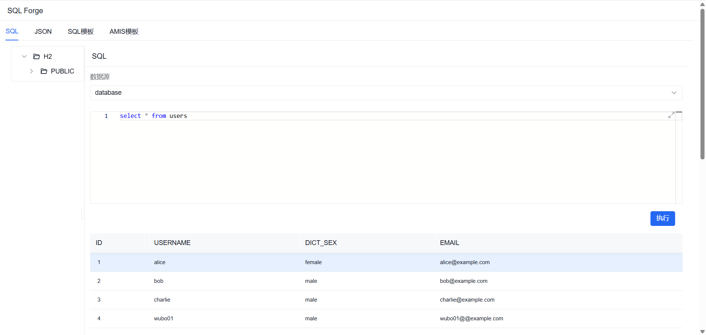
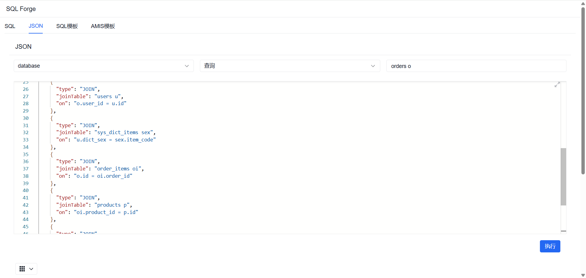
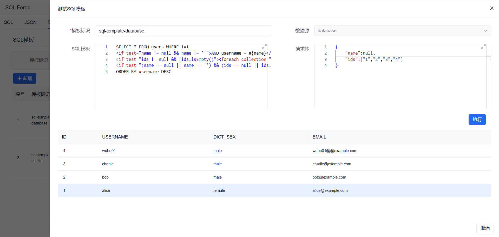
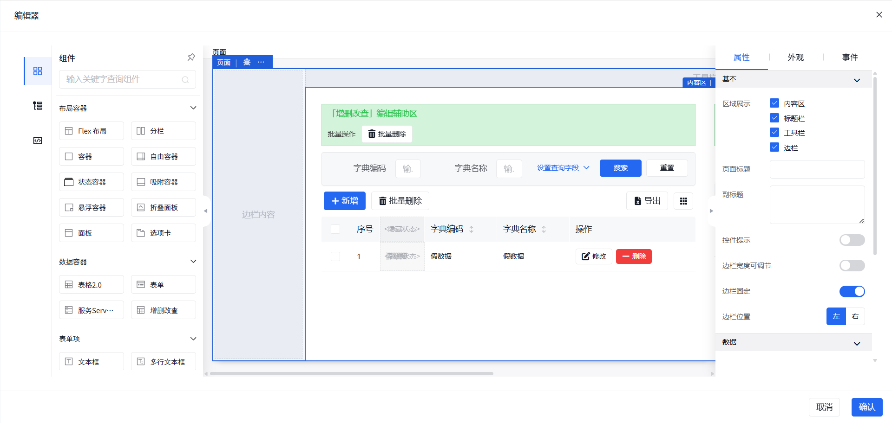

# SQL Forge - SQL工坊

<div align="right">
  <a href="README.md">English</a> | 中文
</div>

> **SQL工坊**不仅是一个ORM框架，更是一套基于数据库的完整解决方案，它提供：
> - 提供基础的数据库支持
> - 跨数据库联邦查询
> - 提供基于 JSON 的数据库 CRUD 操作
> - 提供实体对象的链式操作
> - SQL 模板引擎
> - Amis 低代码可视化编辑和模板管理
> - Web 控制台

[](https://jitpack.io/#com.gitee.wb04307201/sql-forge)
[](https://gitee.com/wb04307201/sql-forge)
[](https://gitee.com/wb04307201/sql-forge)
[](https://github.com/wb04307201/sql-forge)
[](https://github.com/wb04307201/sql-forge)  
  

## 使用
### 引入依赖
增加 JitPack 仓库
```xml
<repositories>
    <repository>
        <id>jitpack.io</id>
        <url>https://jitpack.io</url>
    </repository>
</repositories>
```

```xml
<dependency>
    <groupId>com.gitee.wb04307201.sql-forge</groupId>
    <artifactId>sql-forge-spring-boot-starter</artifactId>
    <version>1.5.8</version>
</dependency>
<dependency>
    <groupId>jakarta.persistence</groupId>
    <artifactId>jakarta.persistence-api</artifactId>
    <version>3.2.0</version>
</dependency>
```

## 功能说明

### SQL执行器
#### database-项目数据库
会从Spring项目已经配的数据源直接引用
```yaml
sql:
  forge:
    schemata:  #配置schema
      - PUBLIC
```
#### calcite-Apache Calcite跨数据库联邦查询
启用calcite并指定Apache Calcite数据源信息
```yaml
sql:
  forge:
    calcite:
      enabled: true
      configuration: classpath:model.json
      schemata: #配置schema
        - MYSQL
        - POSTGRES
```
#### 自定义扩展
继承[IExecutor.java](sql-forge-core/src/main/java/cn/wubo/sql/forge/IExecutor.java)实现自定义执行器

### Json API 模块
让前端无需编写后端代码即可操作数据库，通过`JSON`格式描述自己需要的数据结构和操作，后端自动生成对应的`SQL`执行并返回结果。

- **请求路径**: `sql/forge/api/json/{method}/{tableName}?executorName={executorName}`
- **请求方法**: `POST`
- **内容类型**: `application/json`
- **路径参数**:
  - `{method}`: 操作方法类型(delete、insert、select、update)
  - `{tableName}`: 数据库表名称
  - `{executorName}`: 数据库执行器名称,默认支持database(项目数据库),calcite(Apache Calcite跨数据库联邦查询)，支持自行扩展，如不传，默认使用database

#### delete 方法

#### 请求格式
```json
{
  "@where": [
    {
      "column": "字段名",
      "condition": "条件类型",
      "value": "值"
    }
  ],
  "@with_select": {
    // 删除后后查询json
  }
}
```

#### 参数说明
- `@where`: 删除条件数组，每个条件包含：
  - column: 要匹配的字段名
  - condition: 条件类型（EQ、NOT_EQ、GT、LT、GTEQ、LTEQ、LIKE、NOT_LIKE、LEFT_LIKE、RIGHT_LIKE、BETWEEN、NOT_BETWEEN、IN、NOT_IN、IS_NULL、IS_NOT_NULL）
  - value: 匹配的值
- `@with_select`: 可选的查询条件，用于在删除后执行一个查询

#### insert 方法

#### 请求格式
```json
{
  "@set": {
    "字段名1": "值1",
    "字段名2": "值2"
  },
  "@with_select": {
    // 删除后后查询json
  }
}
```

#### 参数说明
- `@set`: 要插入的字段和值的键值对，至少需要一个字段
- `@with_select`: 可选的查询条件，用于插入后执行一个查询

#### select 方法

#### 请求格式
```json
{
  "@column": ["字段名1", "字段名2"],
  "@where": [
    {
      "column": "字段名",
      "condition": "条件类型",
      "value": "值"
    }
  ],
  "@join": [
    {
      "type": "JOIN类型",
      "joinTable": "关联表名",
      "on": "关联条件"
    }
  ],
  "@order": ["字段名 ASC", "字段名 DESC"],
  "@group": ["字段名"],
  "@distince": false
}
```

##### 参数说明
- `@column`: 要查询的字段数组，为空则查询所有字段
- `@where`: 查询条件数组
- `@join`: 关联查询条件数组
- `@order`: 排序字段数组
- `@group`: 分组字段数组
- `@distince`: 是否去重

#### selectPage 方法

#### 请求格式
```json
{
  "@column": ["字段名1", "字段名2"],
  "@where": [
    {
      "column": "字段名",
      "condition": "条件类型",
      "value": "值"
    }
  ],
  "@page": {
    "pageIndex": 0,
    "pageSize": 10
  },
  "@join": [
    {
      "type": "JOIN类型",
      "joinTable": "关联表名",
      "on": "关联条件"
    }
  ],
  "@order": ["字段名 ASC", "字段名 DESC"],
  "@distince": false
}
```

##### 参数说明
- `@column`: 要查询的字段数组，为空则查询所有字段
- `@where`: 查询条件数组
- `@page`分页参数
  - pageIndex: 页码（从0开始）
  - pageSize: 每页大小
- `@join`: 关联查询条件数组
- `@order`: 排序字段数组
- `@distince`: 是否去重

#### update 方法

##### 请求格式
```json
{
  "@set": {
    "字段名1": "新值1",
    "字段名2": "新值2"
  },
  "@where": [
    {
      "column": "字段名",
      "condition": "条件类型",
      "value": "值"
    }
  ],
  "@with_select": {
    // 删除后后查询json
  }
}
```

##### 参数说明
- `@set`: 要更新的字段和新值的键值对，至少需要一个字段
- `@where`: 更新条件数组，指定要更新哪些记录
- `@with_select`: 可选的查询条件，用于更新后执行一个查询

#### 示例
1. 查询
```http request
POST http://localhost:8080/sql/forge/api/json/select/orders o
Content-Type: application/json

{
  "@column": [
    "u.username",
    "sex.item_name             AS sex_name",
    "o.total_amount",
    "p.name               AS product_name",
    "categories.item_name AS product_categories",
    "oi.unit_price",
    "oi.quantity",
    "p.price"
  ],
  "@where": [
    {
      "column": "sex.dict_code",
      "condition": "EQ",
      "value": "sex"
    },
    {
      "column": "categories.dict_code",
      "condition": "EQ",
      "value": "categories"
    }
  ],
  "@join": [
    {
      "type": "JOIN",
      "joinTable": "users u",
      "on": "o.user_id = u.id"
    },
    {
      "type": "JOIN",
      "joinTable": "sys_dict_items sex",
      "on": "u.dict_sex = sex.item_code"
    },
    {
      "type": "JOIN",
      "joinTable": "order_items oi",
      "on": "o.id = oi.order_id"
    },
    {
      "type": "JOIN",
      "joinTable": "products p",
      "on": "oi.product_id = p.id"
    },
    {
      "type": "JOIN",
      "joinTable": "sys_dict_items categories",
      "on": "p.dict_categories = categories.item_code"
    }
  ],
  "@order": [
    "o.order_date"
  ],
  "@group": null,
  "@distince": false
}
```

2. 分页查询
```http request
POST http://localhost:8080/sql/forge/api/json/selectPage/orders o
Content-Type: application/json

{
  "@column": [
    "u.username",
    "sex.item_name             AS sex_name",
    "o.total_amount",
    "p.name               AS product_name",
    "categories.item_name AS product_categories",
    "oi.unit_price",
    "oi.quantity",
    "p.price"
  ],
  "@where": [
    {
      "column": "sex.dict_code",
      "condition": "EQ",
      "value": "sex"
    },
    {
      "column": "categories.dict_code",
      "condition": "EQ",
      "value": "categories"
    }
  ],
  "@join": [
    {
      "type": "JOIN",
      "joinTable": "users u",
      "on": "o.user_id = u.id"
    },
    {
      "type": "JOIN",
      "joinTable": "sys_dict_items sex",
      "on": "u.dict_sex = sex.item_code"
    },
    {
      "type": "JOIN",
      "joinTable": "order_items oi",
      "on": "o.id = oi.order_id"
    },
    {
      "type": "JOIN",
      "joinTable": "products p",
      "on": "oi.product_id = p.id"
    },
    {
      "type": "JOIN",
      "joinTable": "sys_dict_items categories",
      "on": "p.dict_categories = categories.item_code"
    }
  ],
  "@order": [
    "o.order_date"
  ],
  "@group": null,
  "@distince": false,
  "@page": {
    "pageIndex": 0,
    "pageSize": 5
  }
}
```

3. 插入
```http request
POST http://localhost:8080/sql/forge/api/json/insert/users
Content-Type: application/json

{
  "@set": {
    "id": "26a05ba3-913d-4085-a505-36d40021c8d1",
    "username": "wb04307201",
    "email": "wb04307201@gitee.com"
  },
  "@with_select": {
    "@column": null,
    "@where": [
      {
        "column": "id",
        "condition": "EQ",
        "value": "26a05ba3-913d-4085-a505-36d40021c8d1"
      }
    ],
    "@join": null,
    "@order": null,
    "@group": null,
    "@distince": false
  }
}
```

4. 更新
```http request
POST http://localhost:8080/sql/forge/api/json/update/users
Content-Type: application/json

{
  "@set": {
    "email": "wb04307201@github.com"
  },
  "@where": [
    {
      "column": "id",
      "condition": "EQ",
      "value": "26a05ba3-913d-4085-a505-36d40021c8d1"
    }
  ],
  "@with_select": {
    "@column": null,
    "@where": [
      {
        "column": "id",
        "condition": "EQ",
        "value": "26a05ba3-913d-4085-a505-36d40021c8d1"
      }
    ],
    "@join": null,
    "@order": null,
    "@group": null,
    "@distince": false
  }
}
```
5. 删除
```http request
POST http://localhost:8080/sql/forge/api/json/delete/users
Content-Type: application/json

{
  "@where": [
    {
      "column": "id",
      "condition": "EQ",
      "value": "26a05ba3-913d-4085-a505-36d40021c8d1"
    }
  ],
  "@with_select": {
    "@column": null,
    "@where": [
      {
        "column": "id",
        "condition": "EQ",
        "value": "26a05ba3-913d-4085-a505-36d40021c8d1"
      }
    ],
    "@join": null,
    "@order": null,
    "@group": null,
    "@distince": false
  }
}
```

#### 方法执行前切面
可通过实现 [IBeforeRecordExecutor.java](sql-forge-record/src/main/java/cn/wubo/sql/forge/record/IBeforeRecordExecutor.java)接口自定义方法执行前的json调整，实现密码加密、自动更新时间戳、权限控制、日志、审计等

例如实现在Insert时输出日志：
```java
@Slf4j
@Component
public class LogInsertExecute implements IBeforeRecordExecutor<Insert> {
  @Override
  public Boolean support(String tableName, Insert insert) {
    return true;
  }

  @Override
  public Insert before(String tableName, Insert insert) {
    log.info("LogInsertExecute tableName: {} record: {}", tableName, insert);
    return insert;
  }
}
```

#### 配置
可通过`sql.forge.api.json.enabled=false`关闭

### SQL Template API 模块
提供`SQL`模板引擎功能，支持条件判断、循环等模板语法，根据参数动态生成`SQL`执行并返回结果。
- **API 模板管理**：提供 API 模板的存储、查询、删除等管理功能
- **模板化 API 执行**：支持通过模板 ID 和参数来执行预定义的 API 模板

#### 模板管理接口

- `PUT /sql/forge/api/template/sql` - 保存/更新 SQL 模板
  - id: 模板 ID
  - executorName: 执行器名称，默认支持database(项目数据库),calcite(Apache Calcite跨数据库联邦查询)，支持自行扩展
  - context: 模板内容
- `GET /sql/forge/api/template/sql/{id}` - 根据 ID 获取 SQL 模板
- `GET /sql/forge/api/template/sql` - 获取 SQL 模板列表
- `DELETE /sql/forge/api/template/{id}` - 删除指定 ID 的 SQL 模板
- `POST /sql/forge/api/template/sql/{id}` - 执行指定 ID 的 SQL 模板
  - 模板参数 Map

#### 示例
模板配置：
```http request
PUT http://localhost:8080/sql/forge/api/template/sql
content-type: application/json

{
    "id": "sql-template-database",
    "type": "templateSql",
    "executorName": "database",
    "context": "SELECT * FROM users WHERE 1=1\r\n<if test=\"name != null && name != ''\">AND username = #{name}</if>\r\n<if test=\"ids != null && !ids.isEmpty()\"><foreach collection=\"ids\" item=\"id\" open=\"AND id IN (\" separator=\",\" close=\")\">#{id}</foreach></if>\r\n<if test=\"(name == null || name == '') && (ids == null || ids.isEmpty()) \">AND 0=1</if>\r\nORDER BY username DESC"
}
```

执行模板：
```http request
POST http://localhost:8080/sql/forge/api/template/sql-template-database
content-type: application/json

{
"name":"alice",
"ids":null
}
```

响应：
```json
[
  {
    "ID": "1",
    "USERNAME": "alice",
    "DICT_SEX": "female",
    "EMAIL": "alice@example.com"
  }
]
```

#### 配置
可通过`sql.forge.api.template.sql.enabled=false`关闭

#### 持久化模板
继承 [ITemplateSqlStorage.java](sql-forge-template/src/main/java/cn/wubo/sql/forge/ITemplateSqlStorage.java) 实现自己的模板服务

### Amis Template API 模块
使用 [Amis](https://aisuda.bce.baidu.com/amis/zh-CN/docs/index) 配合**Json API**模块、**Template API**模块、**Calcite API**模块快速构建的Web页面。

#### 模板管理接口

- `PUT /sql/forge/api/template/amis` - 保存新的 API 模板
  - id: 模板 ID
  - context: 模板内容
- `GET /sql/forge/api/template/amis/{id}` - 根据 ID 获取模板
- `GET /sql/forge/api/template/amis` - 获取模板列表
- `DELETE /sql/forge/api/template/amis{id}` - 删除指定 ID 的模板

#### 示例
模板配置：
```http request
PUT http://localhost:8080/sql/forge/amis/template
content-type: application/json

{
    "id": "amis-template-users",
    "context": "{\r\n  \"type\": \"page\",\r\n  \"body\": {\r\n    \"type\": \"crud\",\r\n    \"id\": \"crud_table\",\r\n    \"api\": {\r\n      \"method\": \"post\",\r\n      \"url\": \"/sql/forge/api/json/selectPage/USERS\",\r\n      \"data\": {\r\n        \"@column\": [\r\n          \"USERS.ID\",\r\n          \"USERS.USERNAME\",\r\n          \"sex.item_name as SEX\",\r\n          \"USERS.EMAIL\"\r\n        ],\r\n        \"@join\": [\r\n          {\r\n            \"type\": \"LEFT_OUTER_JOIN\",\r\n            \"joinTable\": \"sys_dict_items sex\",\r\n            \"on\": \"USERS.DICT_SEX = sex.item_code\"\r\n          }\r\n        ],\r\n        \"@where\": [\r\n          {\r\n            \"column\": \"USERS.USERNAME\",\r\n            \"condition\": \"LIKE\",\r\n            \"value\": \"${USERNAME | default:undefined}\"\r\n          },\r\n          {\r\n            \"column\": \"USERS.DICT_SEX\",\r\n            \"condition\": \"IN\",\r\n            \"value\": \"${SEX | default:undefined | split}\"\r\n          },\r\n          {\r\n            \"column\": \"USERS.EMAIL\",\r\n            \"condition\": \"LIKE\",\r\n            \"value\": \"${EMAIL | default:undefined}\"\r\n          },\r\n          {\r\n            \"column\": \"sex.dict_code\",\r\n            \"condition\": \"EQ\",\r\n            \"value\": \"sex\"\r\n          }\r\n        ],\r\n        \"@order\": [\r\n          \"${default(orderBy && orderDir ? (orderBy + ' ' + orderDir):'',undefined)}\"\r\n        ],\r\n        \"@page\": {\r\n          \"pageIndex\": \"${page - 1}\",\r\n          \"pageSize\": \"${perPage}\"\r\n        }\r\n      }\r\n    },\r\n    \"headerToolbar\": [\r\n      {\r\n        \"label\": \"新增\",\r\n        \"type\": \"button\",\r\n        \"icon\": \"fa fa-plus\",\r\n        \"level\": \"primary\",\r\n        \"actionType\": \"drawer\",\r\n        \"drawer\": {\r\n          \"title\": \"新增表单\",\r\n          \"body\": {\r\n            \"type\": \"form\",\r\n            \"api\": {\r\n              \"method\": \"post\",\r\n              \"url\": \"/sql/forge/api/json/insert/USERS\",\r\n              \"data\": {\r\n                \"@set\": {\r\n                  \"ID\": \"${ID | default:undefined}\",\r\n                  \"USERNAME\": \"${USERNAME | default:undefined}\",\r\n                  \"DICT_SEX\": \"${DICT_SEX | default:undefined}\",\r\n                  \"EMAIL\": \"${EMAIL | default:undefined}\"\r\n                }\r\n              }\r\n            },\r\n            \"onEvent\": {\r\n              \"submitSucc\": {\r\n                \"actions\": [\r\n                  {\r\n                    \"actionType\": \"reload\",\r\n                    \"componentId\": \"crud_table\"\r\n                  }\r\n                ]\r\n              }\r\n            },\r\n            \"body\": [\r\n              {\r\n                \"type\": \"uuid\",\r\n                \"id\": \"insert-ID\",\r\n                \"name\": \"ID\"\r\n              },\r\n              {\r\n                \"type\": \"input-text\",\r\n                \"name\": \"USERNAME\",\r\n                \"label\": \"用户名\",\r\n                \"maxLength\": 50,\r\n                \"disabled\": false,\r\n                \"id\": \"insert-USERNAME\"\r\n              },\r\n              {\r\n                \"type\": \"select\",\r\n                \"name\": \"DICT_SEX\",\r\n                \"label\": \"性别\",\r\n                \"maxLength\": 100,\r\n                \"source\": {\r\n                  \"method\": \"post\",\r\n                  \"url\": \"/sql/forge/api/json/select/sys_dict_items\",\r\n                  \"data\": {\r\n                    \"@column\": [\r\n                      \"item_code\",\r\n                      \"item_name\"\r\n                    ],\r\n                    \"@where\": [\r\n                      {\r\n                        \"column\": \"dict_code\",\r\n                        \"condition\": \"EQ\",\r\n                        \"value\": \"sex\"\r\n                      }\r\n                    ]\r\n                  },\r\n                  \"adaptor\": \"return {\\n  options: payload.map(item => ({\\n    value: item.item_code || item.ITEM_CODE,\\n    label: item.item_name ||  item.ITEM_NAME\\n  }))\\n};\"\r\n                },\r\n                \"clearable\": true,\r\n                \"disabled\": false,\r\n                \"id\": \"insert-SEX\"\r\n              },\r\n              {\r\n                \"type\": \"input-text\",\r\n                \"name\": \"EMAIL\",\r\n                \"label\": \"用户邮箱地址\",\r\n                \"maxLength\": 100,\r\n                \"disabled\": false,\r\n                \"id\": \"insert-EMAIL\"\r\n              }\r\n            ]\r\n          }\r\n        }\r\n      },\r\n      \"bulkActions\",\r\n      {\r\n        \"type\": \"columns-toggler\",\r\n        \"draggable\": true,\r\n        \"align\": \"right\"\r\n      },\r\n      {\r\n        \"type\": \"export-excel\",\r\n        \"label\": \"导出\",\r\n        \"icon\": \"fa fa-file-excel\",\r\n        \"api\": {\r\n          \"method\": \"post\",\r\n          \"url\": \"/sql/forge/api/json/select/USERS\",\r\n          \"data\": {\r\n            \"@column\": [\r\n              \"USERS.ID\",\r\n              \"USERS.USERNAME\",\r\n              \"sex.item_name as SEX\",\r\n              \"USERS.EMAIL\"\r\n            ],\r\n            \"@join\": [\r\n              {\r\n                \"type\": \"LEFT_OUTER_JOIN\",\r\n                \"joinTable\": \"sys_dict_item sex\",\r\n                \"on\": \"USERS.DICT_SEX = sex.item_code\"\r\n              }\r\n            ],\r\n            \"@where\": [\r\n              {\r\n                \"column\": \"USERS.USERNAME\",\r\n                \"condition\": \"LIKE\",\r\n                \"value\": \"${USERNAME | default:undefined}\"\r\n              },\r\n              {\r\n                \"column\": \"USERS.DICT_SEX\",\r\n                \"condition\": \"IN\",\r\n                \"value\": \"${DICT_SEX | default:undefined | split}\"\r\n              },\r\n              {\r\n                \"column\": \"USERS.EMAIL\",\r\n                \"condition\": \"LIKE\",\r\n                \"value\": \"${EMAIL | default:undefined}\"\r\n              },\r\n              {\r\n                \"column\": \"sex.dict_code\",\r\n                \"condition\": \"EQ\",\r\n                \"value\": \"sex\"\r\n              }\r\n            ]\r\n          }\r\n        },\r\n        \"align\": \"right\"\r\n      }\r\n    ],\r\n    \"footerToolbar\": [\r\n      \"statistics\",\r\n      {\r\n        \"type\": \"pagination\",\r\n        \"layout\": \"total,perPage,pager,go\"\r\n      }\r\n    ],\r\n    \"bulkActions\": [\r\n      {\r\n        \"label\": \"批量删除\",\r\n        \"icon\": \"fa fa-trash\",\r\n        \"actionType\": \"ajax\",\r\n        \"api\": {\r\n          \"method\": \"post\",\r\n          \"url\": \"/sql/forge/api/json/delete/USERS\",\r\n          \"data\": {\r\n            \"@where\": [\r\n              {\r\n                \"column\": \"ID\",\r\n                \"condition\": \"IN\",\r\n                \"value\": \"${ids | split}\"\r\n              }\r\n            ]\r\n          }\r\n        },\r\n        \"confirmText\": \"确定要批量删除?\"\r\n      }\r\n    ],\r\n    \"keepItemSelectionOnPageChange\": true,\r\n    \"labelTpl\": \"${USERNAME}\",\r\n    \"autoFillHeight\": true,\r\n    \"autoGenerateFilter\": true,\r\n    \"showIndex\": true,\r\n    \"primaryField\": \"ID\",\r\n    \"columns\": [\r\n      {\r\n        \"name\": \"ID\",\r\n        \"hidden\": true\r\n      },\r\n      {\r\n        \"name\": \"USERNAME\",\r\n        \"label\": \"用户名\",\r\n        \"sortable\": true,\r\n        \"searchable\": {\r\n          \"type\": \"input-text\",\r\n          \"name\": \"USERNAME\",\r\n          \"label\": \"用户名\",\r\n          \"maxLength\": 50,\r\n          \"placeholder\": \"输入用户名\"\r\n        }\r\n      },\r\n      {\r\n        \"name\": \"SEX\",\r\n        \"label\": \"性别\",\r\n        \"sortable\": true,\r\n        \"searchable\": {\r\n          \"type\": \"select\",\r\n          \"name\": \"SEX\",\r\n          \"label\": \"性别\",\r\n          \"maxLength\": 100,\r\n          \"placeholder\": \"输入性别\",\r\n          \"multiple\": true,\r\n          \"source\": {\r\n            \"method\": \"post\",\r\n            \"url\": \"/sql/forge/api/json/select/sys_dict_items\",\r\n            \"data\": {\r\n              \"@column\": [\r\n                \"item_code\",\r\n                \"item_name\"\r\n              ],\r\n              \"@where\": [\r\n                {\r\n                  \"column\": \"dict_code\",\r\n                  \"condition\": \"EQ\",\r\n                  \"value\": \"sex\"\r\n                }\r\n              ]\r\n            },\r\n            \"adaptor\": \"return {\\n  options: payload.map(item => ({\\n    value: item.item_code || item.ITEM_CODE,\\n    label: item.item_name ||  item.ITEM_NAME\\n  }))\\n};\"\r\n          },\r\n          \"clearable\": true\r\n        }\r\n      },\r\n      {\r\n        \"name\": \"EMAIL\",\r\n        \"label\": \"用户邮箱地址\",\r\n        \"sortable\": true,\r\n        \"searchable\": {\r\n          \"type\": \"input-text\",\r\n          \"name\": \"EMAIL\",\r\n          \"label\": \"用户邮箱地址\",\r\n          \"maxLength\": 100,\r\n          \"placeholder\": \"输入用户邮箱地址\"\r\n        }\r\n      },\r\n      {\r\n        \"type\": \"operation\",\r\n        \"label\": \"操作\",\r\n        \"buttons\": [\r\n          {\r\n            \"label\": \"修改\",\r\n            \"type\": \"button\",\r\n            \"icon\": \"fa fa-pen-to-square\",\r\n            \"actionType\": \"drawer\",\r\n            \"drawer\": {\r\n              \"title\": \"新增表单\",\r\n              \"body\": {\r\n                \"type\": \"form\",\r\n                \"initApi\": {\r\n                  \"method\": \"post\",\r\n                  \"url\": \"/sql/forge/api/json/select/USERS\",\r\n                  \"data\": {\r\n                    \"@column\": [\r\n                      \"USERS.ID\",\r\n                      \"USERS.USERNAME\",\r\n                      \"USERS.SEX\",\r\n                      \"USERS.EMAIL\"\r\n                    ],\r\n                    \"@join\": [\r\n                      {\r\n                        \"type\": \"LEFT_OUTER_JOIN\",\r\n                        \"joinTable\": \"sys_dict_item sex_a814d446\",\r\n                        \"on\": \"USERS.SEX = sex_a814d446.item_code\"\r\n                      }\r\n                    ],\r\n                    \"@where\": [\r\n                      {\r\n                        \"column\": \"USERS.ID\",\r\n                        \"condition\": \"EQ\",\r\n                        \"value\": \"${ID}\"\r\n                      }\r\n                    ]\r\n                  },\r\n                  \"responseData\": {\r\n                    \"&\": \"${items | first}\"\r\n                  }\r\n                },\r\n                \"api\": {\r\n                  \"method\": \"post\",\r\n                  \"url\": \"/sql/forge/api/json/update/USERS\",\r\n                  \"data\": {\r\n                    \"@set\": {\r\n                      \"ID\": \"${ID}\",\r\n                      \"USERNAME\": \"${USERNAME}\",\r\n                      \"SEX\": \"${SEX}\",\r\n                      \"EMAIL\": \"${EMAIL}\"\r\n                    },\r\n                    \"@where\": [\r\n                      {\r\n                        \"column\": \"USERS.ID\",\r\n                        \"condition\": \"EQ\",\r\n                        \"value\": \"${ID}\"\r\n                      }\r\n                    ]\r\n                  }\r\n                },\r\n                \"body\": [\r\n                  {\r\n                    \"type\": \"input-text\",\r\n                    \"name\": \"ID\",\r\n                    \"hidden\": true,\r\n                    \"id\": \"update-ID\"\r\n                  },\r\n                  {\r\n                    \"type\": \"input-text\",\r\n                    \"name\": \"USERNAME\",\r\n                    \"label\": \"用户名\",\r\n                    \"maxLength\": 50,\r\n                    \"disabled\": false,\r\n                    \"id\": \"update-USERNAME\"\r\n                  },\r\n                  {\r\n                    \"type\": \"select\",\r\n                    \"name\": \"SEX\",\r\n                    \"label\": \"性别\",\r\n                    \"maxLength\": 100,\r\n                    \"source\": {\r\n                      \"method\": \"post\",\r\n                      \"url\": \"/sql/forge/api/json/select/sys_dict_item\",\r\n                      \"data\": {\r\n                        \"@column\": [\r\n                          \"item_code\",\r\n                          \"item_name\"\r\n                        ],\r\n                        \"@where\": [\r\n                          {\r\n                            \"column\": \"dict_code\",\r\n                            \"condition\": \"EQ\",\r\n                            \"value\": \"sex\"\r\n                          }\r\n                        ]\r\n                      },\r\n                      \"adaptor\": \"return {\\n  options: payload.map(item => ({\\n    value: item.item_code || item.ITEM_CODE,\\n    label: item.item_name ||  item.ITEM_NAME\\n  }))\\n};\"\r\n                    },\r\n                    \"clearable\": true,\r\n                    \"disabled\": false,\r\n                    \"id\": \"update-SEX\"\r\n                  },\r\n                  {\r\n                    \"type\": \"input-text\",\r\n                    \"name\": \"EMAIL\",\r\n                    \"label\": \"用户邮箱地址\",\r\n                    \"maxLength\": 100,\r\n                    \"disabled\": false,\r\n                    \"id\": \"update-EMAIL\"\r\n                  }\r\n                ]\r\n              }\r\n            }\r\n          },\r\n          {\r\n            \"label\": \"删除\",\r\n            \"type\": \"button\",\r\n            \"icon\": \"fa fa-minus\",\r\n            \"actionType\": \"ajax\",\r\n            \"level\": \"danger\",\r\n            \"confirmText\": \"确认要删除？\",\r\n            \"api\": {\r\n              \"method\": \"post\",\r\n              \"url\": \"/sql/forge/api/json/delete/USERS\",\r\n              \"data\": {\r\n                \"@where\": [\r\n                  {\r\n                    \"column\": \"ID\",\r\n                    \"condition\": \"EQ\",\r\n                    \"value\": \"${ID}\"\r\n                  }\r\n                ]\r\n              }\r\n            }\r\n          }\r\n        ],\r\n        \"fixed\": \"right\"\r\n      }\r\n    ]\r\n  }\r\n}"
}
```

渲染后页面：


#### 配置
可通过`sql.forge.api.template.amis.enabled=false`关闭

#### 持久化模板
继承 [ITemplateAmisStorage.java](sql-forge-template/src/main/java/cn/wubo/sql/forge/ITemplateAmisStorage.java) 实现自己的模板服务

### Entity 模块
- [Entity.java](sql-forge-entity/src/main/java/cn/eubo/sql/forge/Entity.java) 提供了对实体对象进行数据库操作的构建器，包括删除、插入、查询、更新、保存等操作，简化`SQL`构建过程。
- [EntityExecutor.java](sql-forge-entity/src/main/java/cn/eubo/sql/forge/EntityExecutor.java) 负责执行**构建器**的数据库操作。

#### 特点
- 使用链式调用
- 支持类型安全的泛型操作
- 通过构建器模式灵活配置查询条件
- 统一的数据库操作入口

#### 使用示例

假设有一个用户实体类 [User](sql-forge-test/src/test/java/cn/wubo/sql/forge/User.java) ：

```java
@Autowired
private EntityService entityService;


// 查询操作
EntitySelect<User> select = Entity.select(User.class)
                .distinct(true)
                .columns(User::getId, User::getUsername, User::getEmail)
                .orders(User::getUsername)
                .in(User::getUsername, "alice", "bob");
List<User> users = entityService.run(select);
Object key = entityService.run(insert);

// 分页查询操作
EntitySelectPage<User> select = Entity.selectPage(User.class)
        .distinct(true)
        .columns(User::getId, User::getUsername, User::getEmail)
        .orders(User::getUsername)
        .in(User::getUsername, "alice", "bob")
        .page(0, 1);
SelectPageResult<User> users = entityService.run(select);

// 插入操作  
EntityInsert<User> insert = Entity.insert(User.class).set(User::getId, id)
        .set(User::getUsername, "wb04307201")
        .set(User::getEmail, "wb04307201@gitee.com");
int count = entityService.run(update);

// 更新操作
EntityUpdate<User> update = Entity.update(User.class)
        .set(User::getEmail, "wb04307201@github.com")
        .eq(User::getId, id);
int count = entityService.run(update);

// 删除操作
EntityDelete<User> delete = Entity.delete(User.class)
        .eq(User::getId, id);
count = entityService.run(delete);

// 对象保存操作（插入或更新）
User user = new User();
user.setUsername("wb04307201");
user.setEmail("wb04307201@gitee.com");
user = entityService.run(Entity.save(user));
user.setEmail("wb04307201@github.com");
user = entityService.run(Entity.save(user));

// 对象删除操作
int count = entityService.run(Entity.delete(user));
```

#### 查询构造说明

##### 1. 列选择
- column(SFunction<T, ?> column) - 选择单个列
- columns(SFunction<T, ?>... columns) - 选择多个列

##### 2. 查询条件
- eq(SFunction<T, ?> column, Object value) - 等于
- neq(SFunction<T, ?> column, Object value) - 不等于
- gt(SFunction<T, ?> column, Object value) - 大于
- lt(SFunction<T, ?> column, Object value) - 小于
- gteq(SFunction<T, ?> column, Object value) - 大于等于
- lteq(SFunction<T, ?> column, Object value) - 小于等于
- like(SFunction<T, ?> column, Object value) - 模糊匹配
- notLike(SFunction<T, ?> column, Object value) - 不模糊匹配
- leftLike(SFunction<T, ?> column, Object value) - 左模糊匹配
- rightLike(SFunction<T, ?> column, Object value) - 右模糊匹配
- between(SFunction<T, ?> column, Object value1, Object value2) - 在范围内
- notBetween(SFunction<T, ?> column, Object value1, Object value2) - 不在范围内
- in(SFunction<T, ?> column, Object... value) - 在集合中
- notIn(SFunction<T, ?> column, Object... value) - 不在集合中
- isNull(SFunction<T, ?> column) - 为 NULL
- isNotNull(SFunction<T, ?> column) - 不为 NULL

##### 3. 排序
- orderAsc(SFunction<T, ?> column) - 升序排序
- orderDesc(SFunction<T, ?> column) - 降序排序
- orders(SFunction<T, ?>... columns) - 多列排序（默认升序）

##### 4. 分页
- page(Integer pageIndex, Integer pageSize) - 设置分页参数

##### 5. 去重
- distinct(Boolean distinct) - 设置是否去重

#### 对象保存操作构造说明

根据`@Id`注解判断主键字段，如果没有主键字段，抛出 `IllegalArgumentException`
- **插入条件**: 当主键值为 `null` 时执行插入操作
  - `String` 类型主键：自动生成 `UUID` 作为主键值
  - 其他类型主键：使用数据库自动生成的主键值
- **更新条件**: 当主键值不为 `null` 时执行更新操作
  - 使用主键值作为更新条件

### 控制台
提供简单的Web界面用于调试和模板管理：
- 数据库元数据查看，sql调试（默认关闭，通过配置`sql.forge.api.database.enabled=true`开启,默认仅支持查询，可通过`sql.forge.api.database.select-only=false`允许其它操作）
  
- Json API调试
  
- SQL Template API模板维护，调试
  
- Amis Template API模板维护，调试
  

#### 配置
可通过`sql.forge.console.enabled=false`关闭
