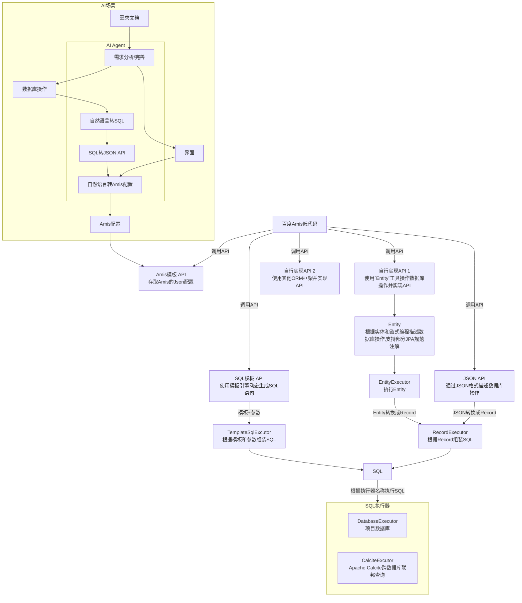

```mermaid
graph TB
  Amis[百度Amis低代码]
  Json[JSON API<br>通过JSON格式描述数据库操作</br>]
  SqlTemplate[SQL模板 API<br>使用模板引擎动态生成SQL语句</br>]
  AmisTemplate[Amis模板 API<br>存取Amis的Json配置</br>]
  RecordExecutor[RecordExecutor<br>根据Record组装SQL</br>]
  API1[自行实现API 1<br>使用`Entity`工具操作数据库操作并实现API</br>]
  API2[自行实现API 2<br>使用其他ORM框架并实现API</br>]
  Entity[Entity<br>根据实体和链式编程‌描述数据库操作,支持部分JPA规范注解</br>]
  EntityExecutor[EntityExecutor<br>执行Entity</br>]
  TemplateSqlExcutor[TemplateSqlExcutor<br>根据模板和参数组装SQL</br>]
  Sql[SQL]
  subgraph ExecutorService[SQL执行器]
    direction LR
    DatabaseExecutor[DatabaseExecutor<br>项目数据库</br>]
    CalciteExcutor[CalciteExcutor<br>Apache Calcite跨数据库联邦查询</br>]
  end
  subgraph AI[AI场景]
    direction LR
    DOC[需求文档]
    PAGE[界面]
    ACTION[数据库操作]
    AmisSchema[Amis配置]

        subgraph AG[AI Agent]
            direction LR
            AG1[需求分析/完善]
            AG2[自然语言转Amis配置]
            AG3[自然语言转SQL]
            AG4[SQL转JSON API]
        end
  end

  Amis -- 调用API --> Json
  Amis -- 调用API --> SqlTemplate
  Amis -- 调用API --> AmisTemplate
  Amis -- 调用API --> API1
  Amis -- 调用API --> API2
  Json -- JSON转换成Record --> RecordExecutor
  API1 --> Entity
  Entity --> EntityExecutor
  EntityExecutor -- Entity转换成Record--> RecordExecutor
  RecordExecutor --> Sql
  SqlTemplate -- 模板+参数 --> TemplateSqlExcutor
  TemplateSqlExcutor --> Sql
  Sql -- 根据执行器名称执行SQL --> ExecutorService
  DOC --> AG1
  AG1 --> PAGE
  AG1 --> ACTION
  PAGE --> AG2
  ACTION --> AG3
  AG3 --> AG4
  AG4 --> AG2
  AG2 --> AmisSchema
  AmisSchema --> AmisTemplate
```